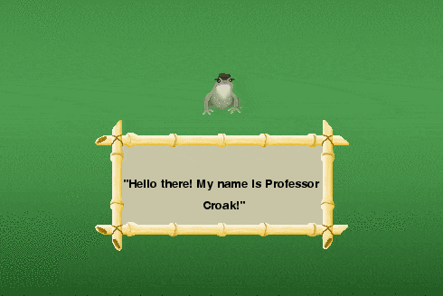

# PythonRPG
RPG made in Python. This project was started somewhere in 2015 before I was using Github, therefore, the initial commit is the whole (very unfinished, somewhat badly programmed) game.

*****

# Why this project?
Making games has always been a passion for me and, IMO, RPG games are the king of games to make, if you have a lot of free time and a friend who's good at art. I highly enjoy making a half serious RPG and adding to it whenever I can. This project, although hopefully constantly updated, will have to sit as a side project as I am part way through year 2 studies of Computer Science.

*****

# TODO
This list should be moderately lengthy for the time being as a lot of the code isn't structured very well, so naturally, the first on the list is:
**REFACTOR**

- ~~Completely change the "classes.py" file (what was I thinking?)~~ 11/12/2016
- Remove/Change the 'ugly' code, ~~such as appending the spritesheet of player~~ 10/12/2016
- ~~Fix collision~~ 9/12/2016

After this is done, adding new (that should already be done) features will take place:

- Pause Menu - Added a pause function for now 13/12/2016
- ~~Entry into houses~~ Kind of - 12/12/2016, cleaned it up 13/12/2016
- ~~Talking to NPCs~~ - 09/01/2017
- Save/Load
- Inventory
- Options (~~Show FPS~~ 22/12/2016, autosave)
- etc

*****

# Prerequisites
You'll need Python3.5+ installed as well as the modules **PyGame** and **PyTMX**. If either needs to be installed then follow the steps:

- [Download PyGame](http://www.lfd.uci.edu/~gohlke/pythonlibs/#pygame) | [Download PyTMX](https://github.com/bitcraft/PyTMX/archive/master.zip)
- Place the download file in your Python3.X\Scripts
- Open CMD in this folder (Alt+D, type CMD, Enter)
- Type "pip3 install pygame" or "pip3 install pytm" click TAB, the rest should be filled in for you
- Enter
